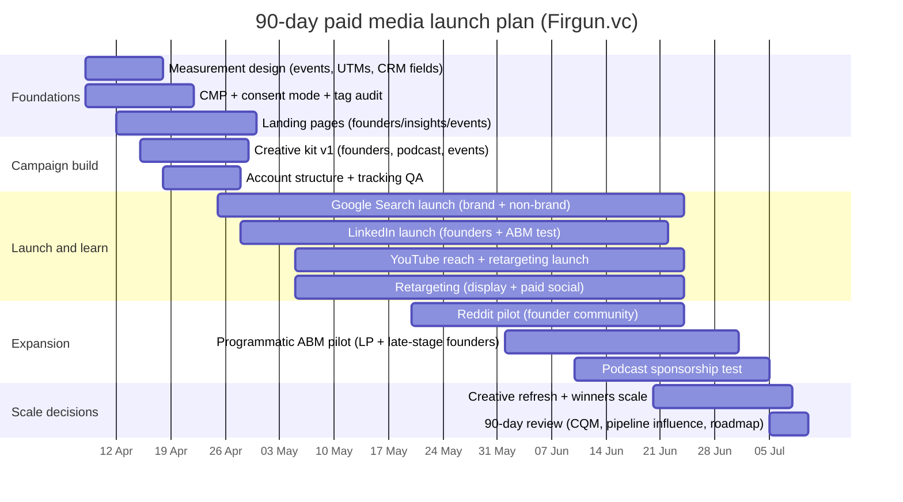

# Paid media strategy for Firgun Ventures

## Executive summary

Firgun positions itself as a **quantum-first VC focused on Series A/B quantum scale-ups**, with a stated ambition to be the “first call” for quantum entrepreneurs ready to scale and to **bridge the Series A/B funding gap**. citeturn2search7turn2search8turn0search0 The website already contains the core conversion and trust assets a paid programme needs (contact form with lead-type routing, newsletter subscription, podcast hub, “News” updates, and an investor portal referenced in legal terms). citeturn0search1turn0search7turn0search2turn0search5turn3view0

At the same time, Firgun’s legal disclaimer is explicit that site content is **for professional/institutional/sophisticated investors** and is **not an offer or solicitation**, with fund materials provided separately only to people meeting regulatory/qualification requirements. citeturn3view0 This makes **LP-facing paid media** feasible only as a **compliance-first, gated, ABM-led** motion (brand/insights distribution → relationship conversion), not a mass acquisition channel.

Paid media should therefore be designed for a **small, high-value market**, where the goal is to win *qualified conversations* (founders, partners, eligible allocators) rather than high lead volume. Industry sizing supports this “precision” approach: QED‑C’s 2025 snapshot (data current as of end‑2024) reports **6,502 quantum-engaged organisations**, **513 pure-play quantum companies**, and strong regional concentration (e.g., Europe & Central Asia and North America). citeturn6view1turn5view0

### Recommended primary objectives and priority order

**Priority order (recommended for the first 12 months; first 90 days heavily focused on the top three):**

| Objective | Priority order | Why this comes first for Firgun | What paid must do |
|---|---:|---|---|
| Brand awareness & credibility | 1 | Trust is the gating factor in deep tech VC selection; Firgun is positioning as the Series A/B quantum specialist. citeturn2search8turn0search6 | Establish authority via YouTube/LinkedIn thought leadership, conference amplification, PR retargeting |
| Dealflow (Series A/B) | 2 | Stated focus is Series A/B quantum scale-ups and bridging the funding gap at A/B. citeturn0search0turn2search7turn0search6 | Capture high intent (Search) + retarget engaged visitors into founder enquiries |
| Community building (podcast/newsletter/events) | 3 | Firgun already runs a podcast and newsletter; paid can scale distribution sustainably. citeturn0search2turn0search7turn0search5 | Build owned audiences and retargeting pools; convert engagement into enquiries |
| Ecosystem partnerships | 4 | Events/speaking + ecosystem convening drive proprietary dealflow and brand lift. citeturn0search5 | Target partners (corporates, institutes, ecosystem builders) with position-led offers |
| Talent hiring | 5 | Careers page exists but is “coming soon” (unspecified open roles). citeturn0search9 | Always‑on employer brand + “warm” retargeting; switch to hiring campaigns when roles exist |
| LP acquisition | 6 | Highly constrained by financial promotions, eligibility, and Firgun’s own disclaimer posture. citeturn3view0turn7search0turn7search1 | ABM + gated investor materials + event-led relationship conversion |

### Budget scenarios (unspecified budget → recommended ranges)

These are *monthly media-only* ranges (excluding creative production and landing page work; both are currently unspecified).

- **Early (test & instrument, months 1–3): £10k–£25k/month**
- **Growth (scale proven plays, months 4–9): £25k–£60k/month**
- **Scale (always-on + ABM + sponsorships, months 10–12+): £60k–£150k/month**

## Objectives and funnel architecture

Firgun’s site already supports a workable conversion flow: the contact form routes enquiries by **Type** (Startup / LP / VC / Other). citeturn0search1 The homepage and FAQ establish the A/B thesis and sector scope (computing, communications/cryptography, sensing/imaging). citeturn0search3turn2search7turn0search0

### Recommended paid funnel model

**Upper funnel (credibility + reach)**  
Promote “who Firgun is” and “what Firgun backs” with proof signals and viewpoints: Series A/B quantum focus, “hands-on partner,” portfolio messaging, council/team credibility, and active participation in industry events. citeturn0search6turn0search8turn0search5

**Mid funnel (education + intent building)**  
Route paid traffic into **audience-specific landing paths** rather than the generic homepage (details below). Use content that converts *attention into retargetable audiences*: short playbooks, checklists, event recaps, and podcast clips. citeturn0search2turn0search7turn0search5

**Lower funnel (conversion + qualification)**  
Optimise to “qualified conversation” outcomes, using Firgun’s contact form lead-type routing and (recommended) calendar booking for founders/partners. citeturn0search1 For LPs, ensure gated access aligns with Firgun’s disclaimer on eligibility and “not an offer/solicitation”. citeturn3view0

### Landing pages to add (highest leverage before scaling)

These are currently **unspecified on the site** (i.e., not evidenced as existing dedicated pages), but strongly recommended for paid efficiency and measurement clarity.

- **/founders**: Series A/B fit, what Firgun helps with, process, proof
- **/insights**: podcast + newsletter archive + “download” assets
- **/events**: calendar + registration + recap pages (retargeting anchors)
- **/investors**: gated, eligibility acknowledgement, links to investor portal (investor portal is referenced in legal terms) citeturn3view0
- **/careers**: currently “coming soon”; publish roles before running hiring acquisition citeturn0search9

## Audience segmentation and personas

QED‑C’s 2025 industry snapshot gives an empirical base for planning audience size: **513 pure-play quantum companies** and **6,502 quantum-engaged organisations**, with **5,989 partial-play** organisations and meaningful regional concentration. citeturn6view1 Use this to justify **ABM + hubs strategy** (rather than broad consumer-style reach).

### Personas, estimated sizes, intent signals, and channels

Figures below are planning ranges; exact platform audience sizes are **unspecified** until you build live audiences and validate match rates (also affected by consent). citeturn6view1turn7search2turn4search3

| Segment | Persona (decision-maker) | Estimated audience size (planning view) | High-intent signals (targeting/retargeting) | Best channels to reach |
|---|---|---:|---|---|
| Founders (primary) | Quantum Series A/B CEO/CTO scaling to revenue pathways | TAM anchored by ~513 pure‑play companies; “A/B‑ready” subset is a minority at any time (assumption; validate via ABM lists). citeturn6view1turn0search0 | Search queries for Series A/B funding; repeat visits to portfolio/team/FAQ; engagement with podcast/event recaps. citeturn0search6turn0search8turn0search2turn0search5 | Google Search, LinkedIn, YouTube, programmatic ABM, retargeting |
| Founders (secondary) | Seed founder (pipeline building for future A/B) | Wider pool in the ~513 universe; focus on top hubs (regional distribution in QED‑C). citeturn6view1 | Engagement with “what we look for”; newsletter signups; podcast completion; event registrations. citeturn0search7turn0search2turn0search5 | LinkedIn, YouTube, Reddit (carefully), low-cost retargeting |
| LPs (controlled) | Institutional allocator (VC/PE alternatives) | TAM is large but reachable SOM should be **named account lists** (ABM); investor eligibility gating required. citeturn3view0 | Visits to gated investor pages; engagement with investment thesis content; conference-based engagement. citeturn3view0turn0search5 | LinkedIn ABM, programmatic ABM, selective podcasts/events; limited Search |
| LPs (secondary) | Single family office CIO/Principal | ~8,030 single family offices globally (2024 estimate). citeturn4search2turn4search6 | “Quantum investing” / “deep tech fund” intent; thought leadership engagement; referrals | LinkedIn ABM, programmatic ABM, podcasts/events; retargeting |
| Talent | VC associate / platform / operator with quantum adjacency | Pure‑play quantum workforce estimated at ~14,517 globally (2024), with ~7,300+ job & internship openings (2023/2024 range). citeturn6view1turn0search9 | Careers page visits; team/about dwell time; job intent searches; LinkedIn profile skills signals | LinkedIn (primary), Search (brand + role), retargeting |
| Ecosystem partners | Corporate innovation / institutes / ecosystem builders | Partial‑play organisations ~5,989, plus universities and other entities in QED‑C ecosystem structure. citeturn6view1 | Event attendance; partnership enquiries; content downloads; podcast shares | LinkedIn, YouTube, events, programmatic niche placements |

## Competitive landscape

Firgun competes for attention with (a) quantum-specialist funds and (b) deep-tech funds that have a clear quantum/next‑gen compute thesis. Firgun’s stated differentiation is **Series A/B quantum scale-up focus**, in contrast to many quantum investors skewing earlier stage. citeturn0search0turn2search7

### Corrected competitive landscape table (clean organisation names, no entity wrappers)

| Comparable VC | Positioning (from public messaging) | Likely paid media posture | Creative examples that tend to work for this class of VC |
|---|---|---|---|
| Quantonation | Global early-stage fund investing in quantum / deep physics. citeturn15search2turn15search5 | Mostly organic thought leadership + selective paid boosts around fund closes, reports, events citeturn15search5turn11search2 | “New fund / portfolio news”, “download thesis/report”, event invitations citeturn15search5turn15search8 |
| 55 North | 100% focused on the quantum stack; positions as a dedicated quantum fund. citeturn15search0turn10search1 | Likely LinkedIn reach + event sponsorships; selective search on brand | “Europe leads quantum commercialisation”, “fund announcements”, “portfolio wins” citeturn10search1turn15search0 |
| QAI Ventures | Global VC + ecosystem builder across quantum / QuantumAI / advanced computing. citeturn10search2turn10search10 | Likely runs paid to accelerators/events and ecosystem programmes; ABM for corporates citeturn10search6 | “Apply to accelerator”, “industry cluster programme”, “ecosystem membership” citeturn10search6turn10search2 |
| QDNL Participations | Bridge from grant phase to venture; early-stage quantum fund. citeturn10search3turn10search11 | Likely light paid; community/event-first | “Bridge funding gap”, “ecosystem building”, “new fund close” citeturn10search3turn10search11 |
| Vsquared Ventures | Pan-European deep tech; highlights early quantum investments. citeturn14view0turn12search18 | Likely LinkedIn content amplification; occasional display for reports | “Generational Growth Themes”, “new fund”, “portfolio milestone” citeturn14view0turn13search0 |
| Playground Global | Frontier/deep tech; explicitly references quantum computing as “next gen compute”. citeturn11search1 | Often content-led; could use paid to distribute portfolio narratives and reports | “Next gen compute”, “breakthrough science → companies”, “portfolio story” citeturn11search1turn11search4 |
| DCVC | Deep tech VC; publishes “Deep Tech Opportunities” content. citeturn11search2turn11search11 | Likely uses paid to distribute flagship reports and capture emails | “Download report”, “industrial themes”, report snippets citeturn11search2turn15search3 |
| Lux Capital | Early-stage science/tech; explicit quantum investments. citeturn17search11turn17search2 | Likely PR-led + selective paid boosts; heavy content distribution | “Investing in breakthrough science”, “portfolio breakthroughs”, podcast clips citeturn17search4turn17search8 |
| IQ Capital | European deep tech VC. citeturn13search2turn13search16 | Likely LinkedIn always-on (hiring + portfolio) | “Deep tech in Europe”, “portfolio funding announcements” citeturn13search2turn12search0 |
| Amadeus Capital Partners | Invests in AI, quantum, advanced computing. citeturn13search3turn17search3 | Likely LinkedIn/industry publication sponsorship; retargeting for content | “Quantum networking milestone”, “commercial applications” citeturn13search6turn12search5 |

**Competitive advantage implication for Firgun:** many comparables skew earlier-stage or broader deep tech; Firgun can differentiate in paid by owning the **“Series A/B quantum scaling partner”** narrative and keyword space, and by offering *Series A/B-specific* content (pilots → repeatable revenue, hiring, commercialisation milestones). citeturn0search0turn2search7turn0search6

## Channel strategy, budgets, KPIs, and expected CPL ranges

### Channel allocation by phase (recommended)

| Phase | Monthly budget range | Primary goal | Recommended split (directional) |
|---|---:|---|---|
| Early (test & instrument) | £10k–£25k | Measurement + prove cost per qualified meeting (CQM) | Search 25–35%, LinkedIn 35–45%, YouTube 5–15%, retargeting 10–15%, experiments 5–10% |
| Growth (scale proven plays) | £25k–£60k | Scale winners + introduce ABM | Search 20–30%, LinkedIn 30–40%, YouTube 10–20%, programmatic ABM 10–20%, retargeting 10–15% |
| Scale (always-on) | £60k–£150k | Always‑on + sponsorships/events | Search 15–25%, LinkedIn 25–35%, YouTube 15–25%, programmatic ABM 15–25%, podcasts/events 10–20% |

### Cost and performance assumptions used for CPL/CPA ranges

CPL/CPA ranges below are **planning assumptions** (not guarantees) and must be validated in-market. Where external benchmarks are referenced, they are **industry aggregations**, not platform commitments.

- Google Ads benchmarks: WordStream reports an overall average conversion rate around ~6.96% (2024) and an average cost per lead around ~$70.11 (Google Ads, cross-industry), while Finance & Insurance conversion rates are markedly lower in their benchmark dataset. citeturn16search0turn16search4turn16search1  
- LinkedIn benchmarks (directional): a benchmark compilation reports medians around CTR ~0.52%, CPC ~$3.94, CPM ~$31–$38, with lead gen forms often converting higher than external landing pages (dataset-dependent). citeturn16search2  
- YouTube CPM benchmarks (directional): one benchmark source cites skippable in-stream CPM ranges around ~$5–$10 and non-skippable ~ ~$6–$10 (format and targeting dependent). citeturn16search3turn16search10  
- Podcast CPM benchmarks (directional): Acast cites $15–$30 CPM for pre-recorded ads and $25–$40 CPM for host-read sponsorships, varying by show, targeting, and placement. citeturn9search2  

### Channel-by-channel operating plan

| Channel | Best-fit objectives | Campaign types to run | Targeting approach | Bidding & optimisation | Creative that works | Best landing page | KPI focus | Expected CPL/CPA range (GBP, planning) |
|---|---|---|---|---|---|---|---|---|
| Google Search | Dealflow, talent, limited LP | Brand, non-brand intent, competitor/alternatives, event keywords | High-intent keywords (Series A/B + quantum + funding); geo hubs; brand defence citeturn0search0turn2search7 | Start with conservative bid controls → move to automated conversion bidding when conversion signals are stable (conversion setup guidance). citeturn9search13turn9search0 | “Series A/B quantum scaling partner”, proof points (portfolio, hands-on) citeturn0search6 | /founders, /careers | CTR, CVR, CQM | Founders: £80–£300; Talent: £30–£150; LP: £300–£1,500 (low volume, gated) |
| Display (GDN) + retargeting | Brand recall, nurture | Site retargeting, contextual placements, custom segments | Retarget podcast/news visitors; contextual quantum/deep tech inventory citeturn0search2turn0search5 | Optimise first to quality visits, then to leads; cap frequency | Quote cards, podcast clips, founder checklists | /insights, /founders | Frequency, engaged sessions, assisted conversion | £150–£600 (primarily assisted; judge by lift + CQM assist) |
| YouTube | Brand authority, community | Video reach, skippable in-stream, bumper, demand gen to site | Custom intent (quantum topics), placements on relevant channels; retarget visitors (skippable format spec). citeturn16search10 | CPM/CPV bidding; optimise to completed views or engaged views | 15–30s “What we look for at Series A/B”, 6s bumpers, event speaker promos citeturn0search5turn0search0 | /podcast, /insights, /events | VTR/CPV, brand search lift, engaged visits | Newsletter CPL-equivalent: £5–£25; founder lead assist: £200–£800 |
| LinkedIn | Dealflow, LP ABM, talent | Sponsored content, document ads, lead gen forms, conversation ads | Job title + seniority + company lists (ABM); skills targeting | Optimise by form completion; use Insight Tag conversions where driving to site (conversion tracking setup). citeturn8search1turn8search18 | Founder: “Series A/B readiness checklist”; LP: “Quantum market note” (gated); Talent: mission + credibility citeturn0search0turn3view0turn0search8 | /founders + lead forms; gated /investors | CPL, CQM rate, lead quality score | Founders: £200–£700; LP ABM: £400–£2,000; Talent: £80–£300 |
| X/Twitter | Community, awareness, event amplification | Engagement, video views, site clicks | Interest/keyword targeting; follower lookalikes of quantum topics | Optimise to engaged clicks; cap frequency | Short POV clips, event commentary, podcast snippets citeturn0search2turn0search5 | /podcast, /news | Engagement rate, quality sessions | £50–£250 (community); founder assist £200–£800 |
| Facebook/Instagram | Retargeting, community | Retargeting, video views, newsletter lead forms | Primarily retarget site visitors and engaged audiences | Optimise to leads (Meta pixel “Lead” standard event definition). citeturn9search3 | Podcast reels, event promos, founder explainer carousels | /podcast, /newsletter | Newsletter CPL, frequency, assisted conv | Newsletter: £3–£20; founder assist: £200–£900 |
| Reddit | Founder pipeline, community trust | Subreddit/context targeting, conversation-style ads, AMAs | Target quantum/AI communities; keyword targeting; promote “AMA” content (Reddit ad types). citeturn8search3turn8search7 | Optimise to landing page quality first, then leads | “AMA with a quantum investor”; “Series A/B scaling pitfalls” | /insights, dedicated AMA page | CTR, engaged time, qualified visits | £60–£300 (traffic); £150–£600 (leads) |
| Podcasts (paid sponsorships) | Brand authority, LP adjacency | Host-read, baked-in, newsletter swaps | Target deep tech, quantum, institutional allocator shows | CPM buys; evaluate via brand search and direct traffic lift (Acast CPM guidance). citeturn9search2 | 30–60s host-read with credibility hook + clear CTA | Vanity URL landing page | Reach, brand lift, assisted conv | CPM widely variable; use Acast ranges as planning baseline |
| Programmatic ABM (DSP) | LP ABM + late-stage founder ABM | Account-based display/video, retargeting | Named account lists, firmographics, contextual | vCPM optimisation; strict frequency caps; measure coverage + lift | High-credibility static + short video; “request materials” | Gated /investors, /founders | Account reach %, lift, meeting rate | LP: £600–£2,500; Founders: £250–£1,000 (pipeline influence) |
| Events (paid distribution + sponsorship) | Credibility, ecosystem, dealflow | Sponsorship + paid social amplification + remarketing | Amplify Firgun’s speaking/event calendar and recaps citeturn0search5 | Optimise to registrations + post-event meetings | “Meet us at [event]”, speaker clips, post-event highlights | /events + recap pages | Registrations, meeting set rate | Highly variable; treat as meeting CAC, not pure CPL |

## Measurement, tracking, attribution, and reporting cadence

Tracking and compliance must be designed together. Firgun’s legal page includes the disclaimer posture and references privacy/cookie policy and an investor portal. citeturn3view0

### Conversion events to implement (minimum viable set)

**Primary conversions (hard outcomes)**
- Contact form submit with “Type = Startup” (qualified founder enquiry) citeturn0search1  
- Contact form submit with “Type = LP” (eligible investor enquiry; must remain compliant with disclaimer posture) citeturn0search1turn3view0  
- Calendar booking completion (recommended; currently unspecified)  
- Investor gated access request (eligibility acknowledged; investor portal access is restricted in legal terms) citeturn3view0  

**Secondary conversions (soft outcomes)**
- Newsletter signup citeturn0search7  
- Podcast engagement (e.g., episode page view, outbound clicks) citeturn0search2  
- Event registrations + recap-page engagement citeturn0search5  

### GA4 + tagging principles

- Use GA4 recommended events (e.g., “generate_lead” / lead-gen aligned events) and/or clear custom events with consistent naming conventions; Google documents recommended and custom event references. citeturn7search7turn7search3  
- Implement **Google Ads conversion tracking** using Google’s “web conversions” setup flow (via GA4 import or tag-based). citeturn9search13turn9search0  
- For deeper optimisation, import **offline conversions** (e.g., “qualified meeting held”, “IC reviewed”) using GCLID-based workflows; Google documents offline conversion measurement and GCLID imports. citeturn9search7turn9search1  

### Consent, cookies, and measurement reliability (UK/EU reality)

- The UK ICO states you must clearly explain cookies and obtain consent (with limited “essential” exceptions), and the same rules apply to similar technologies that store/access device information. citeturn4search3turn4search15  
- The EDPB adopted guidelines clarifying the technical scope of ePrivacy rules beyond cookies to other tracking techniques (including pixels/URLs in the guideline set). citeturn8search0turn8search8  
- Use Google consent mode where relevant; Tag Manager documentation describes basic consent mode (tags restricted until user interaction/consent). citeturn7search2turn7search14  

### Pixel setup (platform essentials)

- LinkedIn Insight Tag: add tag for conversion tracking and retargeting; LinkedIn documents Insight Tag and conversion rule setup. citeturn8search18turn8search1  
- Meta Pixel: use “Lead” standard event for form submissions (Meta defines “Lead” as information submission with follow-up expectation). citeturn9search3turn8search2  
- Reddit: align creative format to ad types (image, video, conversation, free-form); Reddit documents available ad types. citeturn8search3turn8search9  

### UTM taxonomy (standardise from day one)

Use a strict taxonomy to support multi-touch reporting and future automation.

```text
utm_source=google | linkedin | youtube | x | meta | reddit | programmatic | podcast | event_partner
utm_medium=cpc | paid_social | paid_video | display | sponsorship
utm_campaign={objective}_{audience}_{geo}_{quarter}_{theme}
utm_content={format}_{hook}_{variant}
utm_term={keyword_or_audience}
```

### Reporting cadence

- **Daily:** spend pacing, tracking integrity, frequency spikes, search term hygiene  
- **Weekly:** CPL/CQM by channel, lead quality review, creative fatigue, landing page CVR  
- **Monthly:** attribution and pipeline influence review, channel mix shifts, test roadmap refresh

## Creative and messaging frameworks

Firgun’s messaging already contains elements that map cleanly into paid creative: Series A/B quantum scale-up focus, “hands-on partner,” global mandate, and active ecosystem presence (podcast, events/news). citeturn2search7turn0search6turn0search2turn0search5

### Messaging pillars (reusable across channels)

- **Stage clarity:** “Series A/B quantum scale-ups” (not generic deep tech). citeturn0search0turn0search6  
- **Commercialisation support:** “beyond foundational research → market adoption / scalable revenue pathways.” citeturn0search0  
- **Credibility proof:** team/council and track record signals. citeturn0search8turn0search6  
- **Ecosystem leadership:** podcast + speaking/event activation. citeturn0search2turn0search5  

### Founder creative framework

**Angles**
- “Are you truly Series A/B ready?” (readiness checklist)
- “What quantum Series B investors underwrite” (benchmark note)
- “Scaling a quantum team beyond the lab” (commercial + hiring readiness)

**Formats**
- LinkedIn document ad: “Quantum Series A/B Scaling Checklist”
- YouTube: 15–30s founder-facing clarity (“what we look for at Series A/B”) using skippable in-stream where appropriate citeturn16search10  
- Search RSAs: “Series A/B quantum scale-ups | Hands-on partner”

**CTA hierarchy**
1) Book fit call (recommended; currently unspecified implementation)  
2) Submit deck / intro  
3) Subscribe to scaling insights (newsletter)

### LP creative framework (compliance-first)

Firgun’s disclaimer posture requires eligibility orientation and avoidance of language that could be construed as an offer/solicitation. citeturn3view0 UK FCA rules require financial promotions to be **fair, clear and not misleading**. citeturn7search0turn7search1

**LP-friendly angles**
- “Why Series A/B is the quantum bottleneck” (thesis)
- “State of the quantum industry” with credible third-party data (QED‑C headline metrics) citeturn6view1  
- “How we build access and diligence in a specialised market” (process-led, not return-led)

**LP CTAs**
- “Request investor materials (professional investors only)” (gated)
- “Meet Firgun at [event]” (relationship conversion) citeturn0search5  

### Talent creative framework

Talent campaigns should remain mostly employer-brand until the “Careers” page has concrete roles (currently “coming soon”). citeturn0search9  
- LinkedIn: mission + credibility (“build a new standard for quantum VC operations” aligns with team messaging). citeturn0search8  
- Search: brand + role intent (“quantum VC associate London”)

### Ecosystem partner creative framework

Use concrete convening outcomes anchored to Firgun’s visible activity.
- “Co-host a quantum scale-up session”
- “Invite Firgun speaker / podcast crossover” citeturn0search5turn0search2  

## Ninety-day launch plan and governance

### Timeline and milestones



### Suggested A/B tests and success criteria

| Test | Hypothesis | Primary metric | Success criterion |
|---|---|---:|---|
| Founder landing page: “Book call” vs “Send deck” | Lower friction increases qualified conversions | Qualified meeting rate | +20% CQM at same or lower CPL |
| Founder messaging: “Series A/B scaling partner” vs “bridge funding gap” | Stage clarity improves CVR | CVR | +15% CVR on Search + LinkedIn |
| LinkedIn: Lead Gen Form vs website conversion | Lead form reduces drop-off | CPL | -20% CPL at ≥same lead quality (conversion tracking supported via Insight Tag). citeturn8search1turn8search18 |
| YouTube: 6s bumper vs 15s skippable | Shorter improves reach efficiency | CPM / VTR | +25% reach at same spend (format-dependent) citeturn16search10 |
| Retargeting frequency cap: 3/wk vs 7/wk | Lower frequency reduces fatigue | Assisted conversions | Improved assisted CQM with stable reach |
| LP gating: single-step eligibility vs multi-step | Simpler gating improves completion | Completion rate | +15% completion with no compliance issues (align to Firgun disclaimer posture). citeturn3view0 |
| Podcast CTA: “subscribe” vs “download note” | Specific offer increases attribution | Direct traffic / brand lift | +10% branded/direct lift (podcast CPM ranges vary). citeturn9search2 |

### Optimisation rules (practical guardrails)

- Scale budgets gradually (+20% every 3–5 days) on proven ad sets; reverse if CPL rises >25% without an improvement in lead quality.  
- Weekly Search hygiene: negatives to remove unqualified demand; split talent vs founder intent.  
- Creative refresh cadence: every 14–21 days for paid social/video in small audiences to manage fatigue.  
- Adopt offline conversion imports (qualified meeting held) once CRM fields are mapped; Google documents offline conversion measurement and GCLID workflows. citeturn9search7turn9search1  

### Risks, constraints, and compliance considerations

**Financial promotions and LP marketing (UK/EU)**  
- Firgun’s website explicitly states it is **not an offer or solicitation** and is directed to professional/institutional/sophisticated investors; materials are provided separately only to qualified persons. citeturn3view0  
- FCA rules require communications/financial promotions to be **fair, clear and not misleading**. citeturn7search0  
- FCA guidance (FG24/1) clarifies expectations for financial promotions on social media, relevant to LP-facing ads and any allocator-targeted distribution. citeturn7search1turn7search5  

**Privacy and tracking constraints**  
- ICO cookie guidance requires clear information and consent for non-essential cookies and similar technologies. citeturn4search3turn4search15  
- EDPB guidance clarifies that ePrivacy rules cover tracking techniques beyond cookies, increasing compliance importance for pixels/URLs. citeturn8search0turn8search8  
- Consent mode implementation affects measurement completeness (tags may not fire until consent is captured, depending on configuration). citeturn7search2turn7search14  

**Market constraints and over-frequency risk**  
- The pure-play quantum universe is hundreds, not tens of thousands; without frequency caps and content-led expansion, paid will saturate quickly. citeturn6view1  

### Day‑ninety success definition (what “good” looks like)

By day 90, success should be defined by *infrastructure + repeatability*, not just last-click CPL:

- Tracking integrity: conversions implemented and stable (Google Ads web conversions; LinkedIn Insight Tag; Meta Pixel lead event). citeturn9search13turn8search1turn9search3  
- Repeatable founder acquisition loop: Search + LinkedIn retargeting producing qualified meetings at tolerable planning CPL ranges (calibrated to Firgun’s A/B focus). citeturn0search0turn2search7  
- Community flywheel: paid distribution grows newsletter/podcast audiences and improves remarketing efficiency over time. citeturn0search7turn0search2  
- LP motion: gated, compliance-safe ABM approach aligned to Firgun’s disclaimer posture and FCA expectations. citeturn3view0turn7search0turn7search1