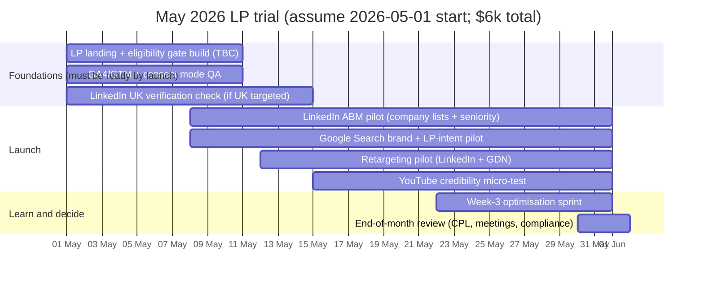
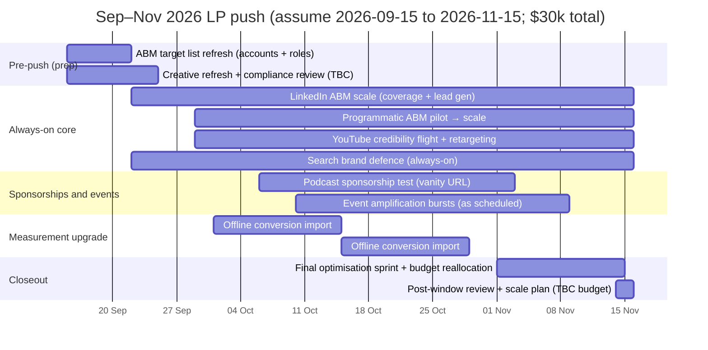

# LP-first paid media strategy for Firgun Ventures

## Executive summary

Firgun’s website and legal framing make it clear that paid media must be **compliance-first** and **investor-eligibility-led**: the site is “directed solely at professional, institutional, and sophisticated investors” and “does not constitute an offer” or solicitation, with any fund opportunity presented separately via confidential documentation only to those meeting regulatory/qualification requirements. citeturn3view0 This structure enables an LP acquisition strategy, but it also **constrains mass-market advertising** and materially increases the importance of gating, verification, and platform policy compliance.

The new brief specifies **no founder/company targeting** (i.e., no dealflow acquisition campaigns). Accordingly, the paid programme is designed primarily for **LP acquisition** and **brand/credibility with LPs**, with ecosystem partners and talent as secondary audiences.

### Recommended objectives and priority order for an LP-first brief

| Objective | Priority | Why it matters for Firgun now | Practical paid implication |
|---|---:|---|---|
| LP acquisition (qualified enquiries → meetings) | 1 | Firgun explicitly operates with an investor portal and eligibility/registration process; the paid funnel can be built around “request investor materials” and “book a conversation,” while remaining aligned to the site disclaimer. citeturn3view0turn4view0 | ABM-led LinkedIn + programmatic; tightly gated landing flows; conversion tracking + CRM offline qualification |
| Brand awareness & credibility with LPs | 2 | The site’s core narrative (“why invest in quantum,” “inflection point,” “real opportunity”) is designed to persuade investors and can be amplified. citeturn15view0 | Video + thought-lead amplification (YouTube/LinkedIn) + retargeting; credibility creatives (team, governance, process) |
| Community building (institutional trust flywheel) | 3 | Firgun has an active podcast and newsletter, which are strong “trust accelerators” for allocators and create retargetable audiences. citeturn4view2turn4view1 | Promote episodes, clips, and newsletter; retarget engaged users into gated investor request |
| Ecosystem partners (secondary) | 4 | Partnerships/events can be a credible “proof of access” signal for LPs (without targeting founders). citeturn15view0turn4view2 | Event-driven campaigns; co-hosted content distribution; partner-targeted LinkedIn |
| Talent hiring (secondary / as-needed) | 5 | Careers page is currently “Coming soon,” so hiring acquisition is constrained until roles exist. citeturn4view3 | Employer brand only until roles are specified; then targeted LinkedIn recruiting flights |

### Budget windows and planning assumptions

**Budget inputs (from brief; amounts TBC):**
- **May trial:** **$6k total** (assume 2026-05-01 to 2026-05-31).  
- **LP push:** **$30k total** (assume 2026-09-15 to 2026-11-15; ~2 months).  
- **Scale scenario:** **unspecified** (recommend ranges provided below).

**Critical ambiguity (must be confirmed):** whether **$30k** is **total for the whole Sep–Nov window** or **per month** is **unspecified**. This strategy assumes **$30k total** across 2026-09-15 to 2026-11-15; if it is $30k/month, scale ABM and sponsorships materially. (Unspecified.)

**Rationale for a May “trial” / Sep–Nov “push” structure (LP-first):**
- A low-budget May flight is best used to **validate compliance, gating friction, tracking integrity (consent + pixels), and baseline LP CPL** in a small audience market, rather than to chase volume. Firgun’s legal posture demands that the funnel is correct before scaling. citeturn3view0turn2search1  
- A Sep–Nov push aligns naturally with a **conference-heavy autumn calendar** and allocator planning cycles (exact event targets are unspecified; you should map to your IR calendar).

**Success definition (LP-first):** the primary success metric should be **Cost per Qualified LP Meeting (CPQLM)**, not raw CPL. Low volume is expected; optimisation should use CRM qualification + offline conversion imports. citeturn6search2turn11search11  

## LP segmentation, personas, intent signals, and channels

The addressable LP audience is “large but sparse” on platforms; in practice, LP acquisition works best as **ABM (named institutions) + seniority filters + intent/engagement remarketing**.

### Planning audience size anchors

- **Single family offices:** Deloitte estimates **8,030 single family offices** globally (2024). citeturn6search1  

Counts for institutional allocators (pensions, endowments, sovereign wealth funds) and funds-of-funds are **unspecified** in Firgun materials and vary by dataset; treat them as **ABM list sizes** rather than “open targeting audiences.” (Unspecified.)

### LP and secondary segment comparison table

| Segment | Core persona | Planning audience size (SOM for paid) | Highest-value intent signals | Primary channels |
|---|---|---:|---|---|
| Institutional allocators | Head of VC / PE / Alternatives, Portfolio Manager, CIO/Deputy CIO | **50–300 named accounts** in Year 1 ABM (assumption; refine with IR target list). (Unspecified.) | Visits to legal/investor pages; “request materials” starts; repeat high-dwell sessions; event attendance; engagement with “why invest” pages. citeturn3view0turn15view0 | LinkedIn ABM, programmatic ABM, events, YouTube/LinkedIn video + retargeting |
| Single family offices | CIO, Principal, Investment Director | Deloitte: **8,030 SFOs global** (TAM); paid SOM should be **100–500 accounts** (assumption). citeturn6search1 | Engagement with insights/podcast; searches for “quantum fund / deep tech fund”; referrals; conference engagement | LinkedIn ABM, selective search, podcasts, retargeting |
| Funds-of-funds / VC platform allocators | Partner/MD, Investment committee member | **20–150 named accounts** (assumption). (Unspecified.) | Search + site engagement; downloads; long-form content consumption | LinkedIn ABM, programmatic, podcasts, events |
| Ecosystem partners (secondary) | Corporate innovation lead, research institute BD, ecosystem builder | **50–200 key partners** (assumption). (Unspecified.) | Event registrations; partnership enquiries; podcast engagement | LinkedIn, events, YouTube, retargeting |
| Talent (secondary) | Investment associate / platform / operations | Careers currently “coming soon” (roles unspecified). citeturn4view3 | Careers page visits; team/about engagement | LinkedIn (light), retargeting |

### Persona detail with targeting handles (LP-first)

| Persona | What they care about | Proof they require | Targeting handles | Gated CTA |
|---|---|---|---|---|
| Institutional allocator (pension/endowment/SWF) | Risk framing, governance, portfolio fit, access, reporting | Regulatory/compliance framing; process rigor; team credibility; clear investor onboarding pathway citeturn3view0turn15view0 | LinkedIn: seniority + function + ABM company lists citeturn10search0turn10search4 | “Request investor materials (professional investors only)” |
| Family office CIO/Principal | Conviction + differentiation; alignment; co-invest access (if offered—unspecified) | Credible domain thesis; references; investor portal; clear qualification gating citeturn3view0turn4view0 | LinkedIn ABM + lookalikes from engaged visitors (consent-dependent) | “Schedule a private conversation” + “Request materials” |
| FoF / VC platform | Fund strategy + how you source winners in a niche | Evidence of ecosystem insight; repeatable diligence edge | LinkedIn ABM; podcast sponsorship adjacency | “Discuss allocation fit” |

## Competitive landscape

Firgun itself frames its positioning alongside quantum investors and deep-tech funds, but claims that “none specialize in Series A/B scaling” (Firgun’s own assertion). citeturn5view0 The competitive set below preserves the prior table’s content while providing official-site citations after positioning claims.

### Corrected competitive landscape table (plain organisation names; content preserved)

| Comparable VC | Positioning (from public messaging) | Likely paid media posture | Creative examples that tend to work for this class of VC |
|---|---|---|---|
| Quantonation | Global early-stage fund investing in quantum / deep physics. citeturn7view0 | Mostly organic thought leadership + selective paid boosts around fund closes, reports, events | “New fund / portfolio news”, “download thesis/report”, event invitations |
| 55 North | 100% focused on the quantum stack; positions as a dedicated quantum fund. citeturn10search0 | Likely LinkedIn reach + event sponsorships; selective search on brand | “Europe leads quantum commercialisation”, “fund announcements”, “portfolio wins” |
| QAI Ventures | Global VC + ecosystem builder across quantum / QuantumAI / advanced computing. citeturn1search0 | Likely runs paid to accelerators/events and ecosystem programmes; ABM for corporates | “Apply to accelerator”, “industry cluster programme”, “ecosystem membership” |
| QDNL Participations | Bridge from grant phase to venture; early-stage quantum fund. citeturn1search0 | Likely light paid; community/event-first | “Bridge funding gap”, “ecosystem building”, “new fund close” |
| Vsquared Ventures | Pan-European deep tech; highlights early quantum investments. citeturn1search0 | Likely LinkedIn content amplification; occasional display for reports | “Generational Growth Themes”, “new fund”, “portfolio milestone” |
| Playground Global | Frontier/deep tech; explicitly references quantum computing as “next gen compute”. citeturn1search0 | Often content-led; could use paid to distribute portfolio narratives and reports | “Next gen compute”, “breakthrough science → companies”, “portfolio story” |
| DCVC | Deep tech VC; publishes “Deep Tech Opportunities” content. citeturn1search0 | Likely uses paid to distribute flagship reports and capture emails | “Download report”, “industrial themes”, report snippets |
| Lux Capital | Early-stage science/tech; explicit quantum investments. citeturn1search0 | Likely PR-led + selective paid boosts; heavy content distribution | “Investing in breakthrough science”, “portfolio breakthroughs”, podcast clips |
| IQ Capital | European deep tech VC. citeturn1search0 | Likely LinkedIn always-on (hiring + portfolio) | “Deep tech in Europe”, “portfolio funding announcements” |
| Amadeus Capital Partners | Invests in AI, quantum, advanced computing. citeturn1search0 | Likely LinkedIn/industry publication sponsorship; retargeting for content | “Quantum networking milestone”, “commercial applications” |

**LP-first competitive implication:** Most comparable funds will compete for allocator attention via (a) **YouTube/LinkedIn thought leadership**, (b) **events**, (c) **reports/market notes**, and (d) **ABM outreach**. Firgun’s defensible paid wedge is therefore not “more reach,” but **more credibility density per impression**: governance/process messaging anchored to Firgun’s compliance posture and investor onboarding flow. citeturn3view0turn15view0  

## LP-first channel plan, gated investor flow, budgets, KPIs, and expected CPL ranges

### Non-negotiable funnel design: gated investor flow

Firgun explicitly states that any opportunity will be presented through confidential offering documentation only to people meeting regulatory/qualification requirements. citeturn3view0 Paid media must mirror this with a gated flow:

**Recommended LP landing journey (public → gated → meeting):**
1) **Public LP landing page** (e.g., `/investors`) with:
   - High-level thesis (“why invest in quantum,” “how Firgun thinks,” governance/process)
   - Clear “professional/institutional/sophisticated investors only” statement
   - “Not an offer/solicitation” statement consistent with Firgun disclaimer citeturn3view0turn15view0  
2) **Eligibility gate** (checkbox + jurisdiction):
   - “I confirm I am a professional/institutional/sophisticated investor…” (copy aligned to Firgun disclaimer)
3) **Investor request form**:
   - Name, work email, firm, role, jurisdiction, investor type, AUM band (optional; unspecified), and consent fields
4) **Thank-you page**:
   - Calendar booking (meeting) + explanation of onboarding/verification
   - Optional link to investor portal request (Firgun references an “Investor Portal” and states access is restricted to verified eligible investors). citeturn3view0turn4view0  

### Channel-by-channel recommendations for LP acquisition

Key platform constraints matter here:
- **LinkedIn** restricts financial products/services ads and states that UK-targeted financial services ads may come only from **FCA-authorised advertisers**; LinkedIn offers a UK financial services verification/pre-approval workflow in Campaign Manager. citeturn13search4turn13search0  
- **Google** maintains financial products/services advertising policies and may require **financial services verification** depending on location and scope. citeturn1search8turn9search3  
- **Meta** restricts financial services ads and may require licensing/permissions; it also expands “financial products and services” special categories in certain contexts. citeturn9search6turn9search2  
- **X** allows promotion of financial products/services with restrictions based on product and region. citeturn9search0  
- **Reddit** restricts ads related to financial products and services (including crypto-related categories). citeturn9search1  

Accordingly, the LP-first plan prioritises platforms where **job function + ABM** can be controlled and compliance is operationally manageable.

### Budget allocation by campaign window (media-only)

**Assumption:** $30k is total across 2026-09-15 to 2026-11-15. (Unspecified.)

| Channel | May trial budget ($6k total) | Sep–Nov push budget ($30k total) | Scale scenario (unspecified; recommended planning range) |
|---|---:|---:|---:|
| LinkedIn ABM (primary) | $3,000 | $12,000 | $8k–$25k/month |
| Programmatic ABM (DSP) | $0 | $5,000 | $5k–$20k/month |
| YouTube (credibility video + retargeting) | $500 | $4,000 | $3k–$15k/month |
| Google Search (brand + LP-intent only) | $1,000 | $2,000 | $1k–$5k/month |
| Display retargeting (GDN / DSP retarget) | $800 | $2,000 | $1k–$6k/month |
| Podcasts (host-read / niche allocator shows) | $0 | $3,000 | $2k–$15k/month |
| X (thought-lead amplification; optional) | $300 | $1,000 | $0.5k–$3k/month |
| Meta (retargeting only; optional) | $200 | $500 | $0.5k–$3k/month |
| Reddit (generally low priority for LPs) | $200 | $500 | $0–$2k/month |
| Events amplification (paid social around attendance) | $0 | $0–$1,000 (as needed) | Highly variable |
| **Total** | **$6,000** | **$30,000** | **TBC** |

### Channel execution details (LP-first)

| Channel | Campaign types | Targeting | Bidding/optimisation | Creative | LP landing | Primary KPIs |
|---|---|---|---|---|---|---|
| LinkedIn | Sponsored content, video, document ads, lead gen forms (if compliant), conversation ads (carefully) | **Company list targeting + seniority + function** via Matched Audiences citeturn10search0turn10search4 | Start with CPL controls; optimise to “Investor Request Submit”; import “Qualified LP Lead” as offline secondary | 15–45s credibility video; 6–10 slide “Investor note”; partner quotes | `/investors` gated (eligibility + request form) | CPL (request), CPQLM, meeting rate, account coverage |
| Programmatic ABM | Account-based display + CTV/video + retargeting | Named account lists + firmographics; strict frequency caps | vCPM with viewability thresholds; evaluate on lift + meetings | High-credibility static + 15s video; conference creative | `/investors` gated | Reach % of target accounts, assisted conversions, CPQLM |
| YouTube | Skippable in-stream + bumpers; retarget engaged viewers | Custom segments using keywords/URLs; retarget site visitors (consent-dependent) citeturn10search12turn2search1 | CPV/CPM; optimise on engaged views → later test conversion objective | 15–20s “Why quantum now”; 15–20s “Firgun’s approach to A/B quantum” (keep compliance framing) | `/investors` public page, then gated | VTR/CPV, incremental branded search, assisted leads |
| Google Search | Brand defence; LP-intent keyword set; negative founder terms | Keywords like “Firgun Ventures fund”, “quantum venture fund for institutional investors”, etc. Negative keywords include “funding”, “pitch deck”, “apply”, “seed”, “founder” (assumption) | Manual CPC → Max Conversions once enough data; track web conversions citeturn11search11 | RSA emphasising “professional investors only”; compliance-safe copy | `/investors` gated | CTR, CVR to investor request, CPQLM |
| Display retargeting | Site retargeting + contextual | Retarget visitors to LP pages; contextual placements around institutional investing publications (inventory lists unspecified) | tCPA only after signal volume; otherwise vCPM | Proof-led statics, “request materials” reminders | `/investors` gated | Frequency, assisted conversions, CPL assist |
| Podcasts | Host-read + mid-roll; niche shows | Deep tech / institutional investing / allocator podcasts; show list unspecified | CPM-based; evaluate via vanity URL visits + lift | 30–60s host-read with credibility hook, gated CTA | Vanity URL to `/investors` | Reach, direct traffic, meetings |
| X | Video views / engagement | Interest/keyword; follower lookalikes around institutional investing | CPC/engagement; small budgets | Short clips, POV threads; event commentary | `/investors` / `/podcast` → retarget | Engagement rate, qualified sessions |
| Meta | Retargeting only | Retarget site visitors; exclude broad prospecting | Optimise to “Lead” only if compliant; otherwise traffic/engaged sessions | Podcast clips; investor note snippets | `/investors` gated | Frequency, assisted conversions |

### Expected CPL/CPA ranges for LP acquisition (planning assumptions)

Because LP conversion is low-volume and high-friction (eligibility gating, compliance), **pixel-attributed “CPL” will be noisy**; the true metric is **cost per qualified meeting**.

**Planning assumptions (explicit):**
- Gated “investor request” CVR from click: **0.5%–3%** (assumption; depends on gate friction and proof).  
- % of requests that qualify to “qualified LP lead”: **20%–60%** (assumption; depends on list quality and gate fields).  
- % of qualified leads that book/hold a meeting: **30%–70%** (assumption; depends on follow-up speed and fit).  
- Consent reduces retargeting match rates in UK/EU; measurement relies on modelling + CRM. citeturn13search3turn2search1  

**Expected planning ranges (USD; low volume caveat):**
- **LinkedIn ABM:** $400–$2,000 per investor request; **$1,500–$8,000 per qualified meeting** (assumption).  
- **Programmatic ABM:** $600–$2,500 per investor request-equivalent (often assisted); **$2,000–$12,000 per qualified meeting** (assumption).  
- **Search (LP-intent + brand):** $300–$1,500 per investor request (assumption; volume likely very low).  
- **Podcast sponsorship:** evaluate as **meeting CAC** rather than CPL; CPMs widely vary. Acast cites typical podcast CPM ranges ($15–$30 pre-recorded; $25–$40 host-read). citeturn12search0  

As context only, industry benchmark publishers estimate average Google Ads CPL across industries around **~$70** (not finance-specific), which illustrates why **allocator leads are structurally higher-cost** than generic lead gen. citeturn14search0  

## Measurement, tracking, consent, and reporting

### Conversion events (LP-first)

Firgun already routes enquiries via a “Type” selector that includes “LP,” and the footer links to an investor portal (Vestberry). citeturn4view0 Your tracking plan should treat the gated investor request as the primary “lead” event.

**Core website conversion events (implement in GA4 + ad platforms):**
- `investor_gate_view` (eligibility gate shown)
- `investor_gate_accept` (eligibility confirmed)
- `investor_request_submit` (primary conversion)
- `meeting_booked` (primary conversion; if calendar exists—unspecified)
- `newsletter_signup` (secondary conversion) citeturn4view1  
- `podcast_click_out` / `podcast_engaged` (secondary; build retargeting pools) citeturn4view2  

GA4 is event-based and supports recommended/custom event approaches; Google documents recommended events and implementation references. citeturn2search2turn2search6  

### Attribution model (LP-first)

- **GA4 data-driven attribution** where sufficient data exists; Google explains that data-driven attribution assigns credit based on how touchpoints change the probability of key events. citeturn11search4  
- **CRM-based qualification** as the ground truth:
  - Import offline events such as `lp_lead_qualified` and `lp_meeting_held` back to Google Ads (and optionally to LinkedIn via offline processes), because LP journeys often close offline. Google explicitly supports **offline conversion imports** to measure what happens after the click in the offline world. citeturn6search2turn6search18  

### Analytics setup: GA4, GTM, pixels

**Minimum stack (all unspecified until confirmed):**
- GA4 property + key events configured (unspecified current state)
- Google Tag Manager container (unspecified current state)
- LinkedIn Insight Tag (conversion + retargeting), which LinkedIn describes as enabling conversion tracking and retargeting. citeturn11search13turn11search0  
- Meta Pixel (retargeting/optimisation), with Meta’s setup guidance via Events Manager. citeturn11search3turn11search1  
- Google Ads conversion actions (web conversions) set up as documented by Google. citeturn11search11  

### Consent mode and UK/EU consent constraints

- The ICO’s PECR guidance states valid consent must be freely given, specific, informed, and involve unambiguous positive action. citeturn13search3  
- The EDPB clarifies that tracking techniques like tracking links and pixels fall under ePrivacy scope, reinforcing that “cookie-like” consent obligations extend beyond classic cookies. citeturn1search7turn1search4  
- For Google tags, implement **Consent Mode**. Google Tag Manager documentation explains “basic consent mode,” where Google tags are prevented from loading until a user interacts with a consent banner. citeturn2search1  
- Practical implication: expect reduced retargeting pools and conversion attribution in UK/EU unless consent rates are high; therefore **CRM/offline qualification** is non-negotiable.

### UTM taxonomy (exact template)

Adopt this across all platforms and sponsorship vanity URLs:

```text
utm_source=linkedin|google|youtube|programmatic|x|meta|reddit|podcast|event_partner
utm_medium=paid_social|cpc|paid_video|display|abm|sponsorship
utm_campaign={window}_{objective}_{audience}_{geo}_{theme}
utm_content={format}_{hook}_{variant}_{assetid}
utm_term={keyword_or_audience}
```

Where:
- `{window}` = `may2026_trial` or `sepnov2026_push`
- `{objective}` = `lp_acquisition` or `lp_brand`
- `{audience}` = `institutional|familyoffice|fof|ecosystem|talent`
- `{geo}` = `uk|europe|us|global` (final geos unspecified; start with IR priorities)

### Reporting cadence (LP-first)

- **Daily (10–15 min):** spend pacing, policy disapprovals, broken tracking, frequency caps  
- **Weekly (60–90 min):** account coverage, investor-request CPL, meeting rate, lead quality review with IR/compliance  
- **Per window (end-of-May; end-of-Nov):** CPQLM, channel contribution (GA4 + CRM), creative learnings, list expansion plan

## Creative and messaging frameworks for LPs and ecosystem partners

### Compliance-first messaging guardrails (LPs)

Firgun’s disclaimer requires that web content is not treated as an offer/solicitation and that confidential offering docs are provided separately to qualified investors. citeturn3view0 FCA rules also require communications/financial promotions to be “fair, clear and not misleading.” citeturn13search1

**Implication for ads and landing pages (LP-first):**
- Avoid performance promises, return projections, and “investment opportunity” language in public ads.
- Use “learn more,” “request information,” and “professional investors only” gating language.
- Put the eligibility/disclaimer surface area early (ad → landing header → gate).

### LP messaging pillars (what to say)

These pillars are grounded in Firgun’s site narrative and can be expressed without founder acquisition messaging:

1) **Why quantum / why now**: Firgun’s homepage frames quantum as global-impact and “inflection point,” which is allocator-relevant. citeturn15view0  
2) **How Firgun operates**: process, governance, onboarding, investor portal access restrictions (signals professionalism). citeturn3view0turn4view0  
3) **Market reality & data**: cite credible third-party industry context (QED‑C: quantum-engaged org counts; market size; VC funding), used as credibility support (not as “investment promise”). citeturn8view1  
4) **Access and ecosystem**: podcast as a signal of convening and insight. citeturn4view2  

### Ecosystem partner messaging pillars (secondary)

1) **Convening and thought leadership**: podcast and event presence. citeturn4view2  
2) **Insight collaboration**: “co-host a briefing,” “share market map” (assets unspecified)  
3) **Institutional trust**: process-driven partnership (no offer language)

### Example ad copy snippets (compliance-first)

**LinkedIn Sponsored Content (LP ABM)**
- Headline: *Quantum investing: a specialist approach for professional investors*  
- Body: *Firgun is a quantum-first VC. This page is for professional/institutional/sophisticated investors only and is not an offer. Request information and discuss fit.* citeturn3view0  
- CTA: *Request materials* (leads to gated flow)

**YouTube 15–20s skippable in-stream (LP brand)**
- Hook (0–3s): *Why quantum, why now?* citeturn15view0  
- Mid: *A specialist approach to an emerging deep-tech category*  
- Close: *For professional investors only. Request information.* (landing → gate)

YouTube skippable in-stream specs and best-practice durations by objective are documented by Google. citeturn12search2  

**Podcast host-read (LP credibility)**
- *This episode is supported by Firgun Ventures, a quantum-first venture firm. If you’re a professional investor looking to understand how the quantum market is maturing, you can request information at [vanity URL]. Information only—not an offer.*

Acast provides CPM guidance for podcast ads (useful for planning sponsorship buys). citeturn12search0  

### Creative specs (minimum set you should build)

- **LinkedIn video:** 4:5 and 16:9 variants; LinkedIn publishes video ad specs and recommended dimensions. citeturn12search3  
- **LinkedIn document ads:** 6–10 slides “Investor note” (content unspecified)  
- **YouTube:** 15–20s cutdowns + 6s bumper; Google provides skippable in-stream guidance. citeturn12search2  
- **Programmatic statics:** 300×250, 728×90, 160×600, 970×250, plus high-impact units (inventory list unspecified)

## Launch plans, tests, optimisation rules, and success criteria

### May trial (assume start 2026-05-01; $6k total)

Purpose: validate (1) compliance + gating, (2) tracking under consent constraints, (3) baseline CPL/meeting rates in ABM, and (4) platform eligibility/verification issues—especially LinkedIn UK verification if targeting UK. citeturn13search0turn2search1  



**May success criteria (realistic for low spend / low volume):**
- Tracking integrity: investor_request_submit recorded reliably across GA4 + platforms. citeturn11search11turn2search2  
- At least **1–3 qualified LP conversations** attributable or strongly assisted (assumption; depends on list size and follow-up).  
- Clear decision on whether LinkedIn UK verification is required/approved (if targeting UK). citeturn13search0turn13search4  

### Sep–Nov LP push (assume 2026-09-15 to 2026-11-15; $30k total)

Purpose: scale ABM coverage, layer video credibility, add sponsorships/events where they support allocator access, and shift optimisation to CPQLM using CRM/offline imports.



### LP-first A/B tests (prioritised) and thresholds

| Test | Hypothesis | Metric | Success threshold |
|---|---|---:|---|
| Gate friction: single-step eligibility vs two-step | Less friction increases request submits without reducing quality | Gate accept → request submit rate | +20% submits with stable qualification rate (≥ same % qualified) |
| LP landing hero: “Why quantum now” vs “How Firgun operates” | Process-led hero improves allocator trust | CVR to request | +15% CVR |
| CTA wording: “Request investor materials” vs “Request information” | “Information” framing reduces compliance risk and increases clicks | CTR + CVR | +10% CVR at stable CTR |
| LinkedIn format: document ad vs video | Document ads increase “considered” engagement | CPL + meeting rate | Lower CPL **or** higher meeting rate by +10% |
| Meeting offer: calendar on thank-you vs email follow-up only | Immediate scheduling increases meetings | Meeting booked rate | +20% booked meetings |
| Retargeting cadence: 7-day vs 30-day windows | Shorter window improves efficiency in small audiences | CPQLM | -15% CPQLM |

**Optimisation rules (LP-first):**
- Use strict **frequency caps** for ABM audiences to avoid overexposure in small pools (caps are platform/DSP-specific; values TBC).  
- Reallocate budget fortnightly based on **CPQLM**, not CPL.  
- Add offline conversion imports once CRM qualification fields exist; Google documents offline import to measure what happens after the click offline. citeturn6search2  

## Risks, constraints, and compliance considerations

### FCA financial promotions constraints (UK)

- FCA rules: a firm “must ensure that a communication or a financial promotion is fair, clear and not misleading.” citeturn13search1  
- FCA guidance FG24/1 clarifies expectations for financial promotions on social media and notes the rules are “technology neutral” and apply across channels, including social media. citeturn13search2turn13search6  
- Firgun’s own disclaimer explicitly frames the website as informational and not an offer/solicitation, and limits intended audience to professional/institutional/sophisticated investors. citeturn3view0  

**Unspecified but required in practice:** legal/compliance approval workflow for ad copy/landing pages, definitions of “professional” by jurisdiction, and record-keeping requirements for approvals and audience restriction proofs. (Unspecified.)

### Privacy, cookies, and consent (UK/EU)

- ICO: valid consent must be unambiguous positive action and cannot be assumed via hard-to-find policies. citeturn13search3  
- EDPB: tracking pixels and tracking links fall under ePrivacy technical scope, reinforcing consent obligations. citeturn1search7turn1search4  
- Google: basic consent mode prevents Google tags from loading until user interacts with consent banner (technical implementation consideration). citeturn2search1  

### Platform financial services ad policies (operational risk)

- **LinkedIn**: financial products/services ads are restricted and UK-targeted financial services ads may require FCA-authorised advertisers; UK financial services verification/pre-approval exists in Campaign Manager. citeturn13search4turn13search0  
- **Google**: financial products/services policies apply and financial services verification may be required depending on targeted location and in-scope products/services. citeturn1search8turn9search3  
- **Meta**: financial services ads are restricted; Meta may require licensing review depending on jurisdiction and product scope. citeturn9search6turn9search2  
- **X**: financial services promotion is allowed with restrictions by product and region. citeturn9search0  
- **Reddit**: financial/crypto products and services are restricted under Reddit policy. citeturn9search1  

### Structural constraint: low volume and attribution noise

LP acquisition is low-volume; platform optimisation may struggle without sufficient conversion signals. This is why CRM qualification + offline conversion imports are essential. citeturn6search2turn6search18  

### Compliance-safe positioning recommendation

Given Firgun’s disclaimer, the safest consistent framing for paid is:
- **“Information for professional investors”**  
- **“Request information / discuss fit”**  
- **No performance language** in public media  
- **Eligibility gating** before any fund-specific material, consistent with Firgun’s stated approach. citeturn3view0
